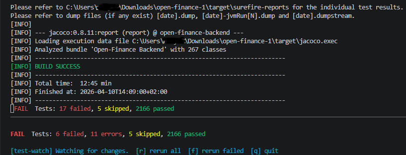

# test-watch-maven-plugin

[](https://github.com/albilu/test-watch-maven-plugin/actions/workflows/maven.yml)
[](https://central.sonatype.com/artifact/io.github.albilu/test-watch-maven-plugin)
[](LICENSE)
[]()

**Vitest-inspired watch mode for Maven tests. Save a file, see your test results instantly — no IDE required.**



---

## Why?

You're working on a Java project. You change a class. Now you need to know if the tests still pass.

Your options:
- **`mvn test`** — slow, runs everything, 30+ seconds of waiting
- **Infinitest** — great, but IDE-specific (Eclipse/IntelliJ only), and doesn't work for everyone's setup
- **Switch to Gradle** just for `--continuous`? Overkill.

**test-watch-maven-plugin** gives you the same instant feedback loop you get with Vitest, Jest, or `cargo watch` — but for Maven. Save a `.java` file, and only the affected tests run. In parallel. With readable output.

---

## Features

- 👀 **File watching** — monitors your source tree for changes
- 🎯 **Smart test selection** — only re-runs tests affected by changed files (configurable patterns)
- ⚡ **Parallel execution** — runs tests concurrently for faster feedback
- 📊 **Readable summaries** — clean pass/fail output, not Maven's wall of text
- 🔌 **Maven-native** — no extra daemon, no IDE plugin, just `mvn`
- 🧩 **Configurable** — include/exclude patterns, test matching, parallel toggle, smart selection toggle

## Requirements

- Java JDK 11+
- Maven 3.6+

## Quick Start

Add the plugin to your `pom.xml`:

```xml
<build>
    <plugins>
        <plugin>
            <groupId>io.github.albilu</groupId>
            <artifactId>test-watch-maven-plugin</artifactId>
            <version>1.1.0</version>
            <configuration>
                <includes>
                    <include>**/*.java</include>
                </includes>
                <excludes>
                    <exclude>**/target/**</exclude>
                </excludes>
                <testPattern>**/*Test.java</testPattern>
                <parallel>false</parallel>
                <smartSelection>true</smartSelection>
            </configuration>
        </plugin>
    </plugins>
</build>
```

Then run:

```bash
mvn test-watch:test
```

The `test` goal runs the suite immediately and then watches for changes. Use
`mvn test-watch:watch` to start watching without an initial run. Run either goal
at the reactor root to watch all selected modules; Maven profiles, command-line
properties, alternate POMs, settings, and module selection carry through to test
invocations.

Press `r` to run the suite, `f` to rerun failed tests from the latest completed
invocation, and `q` to stop. Saving during a run cancels that invocation and
queues the change, including during startup. Each result summary describes the
latest invocation. Compilation errors, cancelled runs, and runs that execute no
tests have distinct statuses.

Include and exclude globs are relative to each module's base directory. Source
roots and build/report directories follow the Maven project configuration.
Dependency selection follows transitive references and nested tests. Changes
with incomplete dependency information, including reflection and compile-time
constants, run the full suite. Set `smartSelection` to `false` to always run the
suite on source changes; the `f` key remains available.

By default, the watcher preserves the project's test execution settings, as
used by `mvn test`. To opt into additional Surefire method parallelism and
JUnit Jupiter concurrent execution, pass `-DtestWatch.parallel=true` or set
`<parallel>true</parallel>` in the plugin configuration. Enable this only for
tests that support concurrent execution. Explicit command-line parallelism
settings take precedence; `parallel=false` leaves the project's own settings
unchanged. The `testPattern` option identifies tests for dependency selection;
align custom patterns with your Surefire test naming configuration.

## Configuration

| Option | Default | Description |
|---|---|---|
| `includes` | `**/*.java` | Files to watch for changes |
| `excludes` | — | Patterns to ignore (e.g., `**/target/**`) |
| `testPattern` | `**/*Test.java` | Pattern to identify test files |
| `parallel` | `false` | Opt into Surefire/JUnit parallel execution (preserves project settings by default) |
| `smartSelection` | `true` | Only run tests affected by changed files |

## How It Works

1. Plugin starts a file watcher on your configured source paths
2. When a `.java` file changes, the plugin identifies which test files to run using `testPattern`
3. With `smartSelection: true`, only tests matching changed source files are executed
4. Tests are dispatched to Maven's invoker framework (parallel when enabled)
5. Results are aggregated into a clean summary

## vs Alternatives

| | test-watch-maven-plugin | Infinitest | `mvn test -pl ...` | Gradle `--continuous` |
|---|---|---|---|---|
| Watch mode | ✅ | ✅ | ❌ | ✅ |
| Maven-native | ✅ | ❌ (IDE plugin) | ✅ | ❌ |
| IDE-agnostic | ✅ | ❌ | ✅ | ✅ |
| Smart selection | ✅ | ✅ | ❌ | ❌ |
| Parallel tests | ✅ | ❌ | ✅ | ✅ |
| CLI-first | ✅ | ❌ | ✅ | ✅ |

## Contributing

Contributions welcome. Please open issues or PRs against this repository. Follow existing code style and include tests for new behavior.

Run `mvn verify` to include the integration projects and their verification
scripts. Their `testWatch.ciMaxRunSeconds` deadline also covers the initial test
invocation.

## License

MIT — see [LICENSE](LICENSE).
